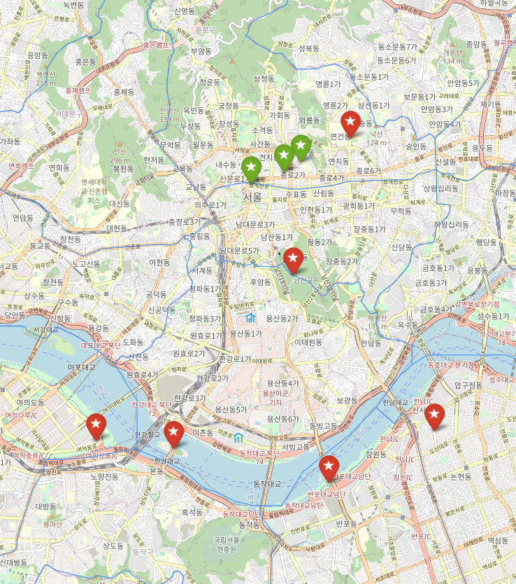

# Python pandas와 folium을 활용한 위시리스트 지도 만들기


## 1. 프로젝트 시작 계기

- 대학 시절 Pandas 패키지는 꽤 사용해봤다. 그러나 이걸 가지고 내가 직접 주도적으로 무언가를 제작해본 기억이 없었다.
- 마침 소중한 사람이 생겼는데, 이곳저곳 같이 여행가고 싶은 마음이 들었다.
- 훨씬 더 잘 되어있는 어플도 많지만, 나만의 Wish list를 만들어서 나만의 지도에 찍어놓는다면 정말 좋을 것이라고 생각했다.
- Geojson 자료를 실제로 활용해볼 겸, Folium 패키지도 같이 활용해보기로 했다.


## 2. 프로젝트 준비

- `https://github.com/southkorea/southkorea-maps`

- 위 사이트에서 전국의 지도 데이터를 Geojson으로 받아왔다.

  - 지도 데이터는 2018년 기준이다.

- 아래 명령어를 터미널에서 작동시켜 필요한 패키지를 파이썬에 모두 설치했다.

  ```bash
  $ pip install pandas, numpy, folium, json
  ```

- 장소 데이터를 기입할 DB를 Excel을 이용하여 `.csv` 확장자로 만들었다.

  - 당시에는 SQL문 등 DB에 관한 지식이 전무하였다.


## 3. 본 프로젝트 코드 작성

1. Dataframe의 이해

   - Dataframe 자료구조는 행렬과 유사한, Pandas 패키지의 매우 강력한 툴이라고 할 수 있다.

   - 행과 열에 직접적으로 이름을 지정할 수도 있으며, 인덱스 접근도 가능하다.

   - 인덱스를 임의로 수정하고, 정렬하는 것도 가능하다.

     ```python
     from pandas import Dataframe
     ```

2. geojson 파일의 이해

   - geojson은 현재 api에서 많이 채용하는 형태인 json과 매우 유사한데, 지도 데이터를 담고 있는 자료이다.
   - 각 지점의 위도 경도 뿐만 아니라 지형, 건물, 도로 정보까지 모두 포함하고 있다.
   - 따라서 geojson 파일에 접근하고 수정하려면 위도, 경도의 표현과 같이 기초적인 GIS 지식을 가지고 있어야 한다.

3. 코드 해석

   ```python
   # -*- coding: utf-8 -*-
   import os
   import pandas as pd
   import folium
   import json
   with open('./skorea-municipalities-2018-geo.json',mode='rt',encoding='utf-8') as f:
       geo = json.loads(f.read())
       f.close() #행정구역 데이터 불러오기
   
   Df = pd.read_excel("./Wishlist.xlsx",header=None) #데이터 pandas로 읽어오기
   Df = Df.rename(columns=Df.iloc[0])
   Df = Df.drop(Df.index[0])
   
   lat = Df['위도'];
   lon = Df['경도'];
   name = Df['장소'];
   arch = Df['달성'];
   lat = lat.astype(float); #숫자로 타입 변경
   lon = lon.astype(float);
   ```

   - 필요한 패키지를 모두 추출하고, 필요한 데이터를 불러와 데이터화시키는 작업이다.
     - `Wishlist.xlsx`
     - `skorea-municipalities-2018-geo.json`
   - Dataframe에서 필요한 테이블을 따로 변수로 지정하여 처리를 편하게 하였다.

   

   ```python
   style1 = {'fillColor': '#FFFFFF', 
             'lineColor': '#91d7ff', 
             'weight': 1, 
             'opacity': 0.65} #스타일 지정
   
   m = folium.Map(location=[37.566345, 126.977893], zoom_start=10); #센터 위치 지정
   folium.GeoJson(geo, name='sk_municipalities', style_function=lambda x:style1).add_to(m) #행정구역 지정하기, 스타일 지정
   ```

   - 지도 데이터에 표시될 행정구역 경계선을 css문을 이용해서 일부 수정하였다.
   - `m`은 지도를 나타내는 객체이다.
     - `m` 객체는 지도의 중심 정보, 확대 정보를 가지고 있다.
   - `folium.GeoJson`을 이용하여 행정구역을 나타낼 선에 방금 만든 `style1` css를 적용했다.

   

   ```python
   for i in range(1,len(lon)):
       if arch[i]==0:
           text = name[i] #위시리스트를 마커 형태로 지도에 추가
           iframe = folium.IFrame(text,width=150,height=50) #팝업창 크기 설정
           popup = folium.Popup(iframe, max_width=200) #팝업창 설정
           folium.Marker(
               location=[lat[i],lon[i]],
               popup=popup,
               icon=folium.Icon(color='red',icon='star')).add_to(m) #마커 설정 및 팝업창 배정
       else:
           text = name[i]
           iframe = folium.IFrame(text,width=150,height=50)
           popup = folium.Popup(iframe, max_width=200)
           folium.Marker(
               location=[lat[i],lon[i]],
               popup=popup,
               icon=folium.Icon(color='green',icon='star')).add_to(m)   
       del text, popup
   
   m.save("./Wishlist.html"); #html 저장
   ```

   - `Wishlist.xlsx`에서 불러온 데이터를 이용하여, 위도와 경도에 원하는 마커를 표시하는 코드이다.
   - 방문했을 경우와 방문하지 않았을 경우를 서로 다른 마커를 이용해서 표시하였다.
   - 또한 `folium.Popup` 클래스를 이용하여 해당 마커를 클릭했을 때 위치 이름이 팝업되도록 하였다.
   - 마지막으로는 이렇게 만든 지도 데이터를 html 파일로 렌더링하여 오프라인에서도 확인할 수 있도록 하였다.


## 4. 엑셀 파일 구성


- 엑셀 파일은 다음과 같이 되어 있다.
- id 필드, 장소명 필드, 위도 필드, 경도 필드, 방문여부 필드
- 추후 DB 관리 프로그램을 따로 이용하여 바꾸어볼 의향이 있다.


## 5. 실제 렌더링된 html 결과물


- 서울에 거주하고 있기 때문에, 서울 지역을 중심부에 확대해서 띄웠다.
- 초록색 마커는 다녀간 곳, 빨간색 마커는 아직 가보지 못한 곳이다.




- `geojson`을 사용했기 때문에, 단순한 이미지파일로서 렌더링되는 것이 아니라 실제 지도처럼 확대가 가능하다.
- 확대해도 해상도가 깨지거나 하지 않는다.


- 위처럼 마커를 클릭하면 해당 장소의 이름을 팝업해준다.


## 6. 프로젝트 소감

- 정말 단순히 하고싶어서 약 1주일동안 진행했던 프로젝트이다.
- 프로젝트를 진행할 당시에는 단순한 호기심으로 했는데, 당시에는 git을 전혀 몰랐기에 뒤늦게 업로드했다.
- 다소 많은 내용을 배운 뒤에 적어보는 README라, 내가 이 프로젝트를 진행할  당시에는 정말 부족한 점이 많았구나를 느꼈다.
- 이제는 mySQL, sqlite3 등 엑셀이 아닌 다른 DB 프로그램도 어느 정도 사용할 수 있게 되었다. Excel보다는 훨씬 더 가볍고 기능이 강력하기 때문에 기회가 되면 꼭 바꿀 것이다.
- 항상 인터넷으로 위치를 쳐보거나, 어플리케이션을 이용해서만 보던걸 직접 구현해보니 정말 재미있었다. 나만의 어플리케이션을 하나 개발한 것 같아서 정말 기쁘다.
- 이제는 `Django` 프레임워크도 사용하는 법을 익혔다. 해당 html을 실제로 사용할  수 있을 것 같다. 지금은 아직 부족하지만, 언젠가는 나만의 어플리케이션을 퍼블리싱해보고 싶다.

